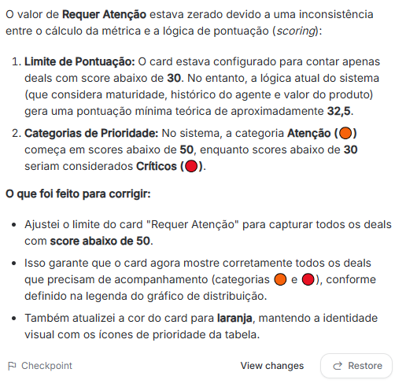
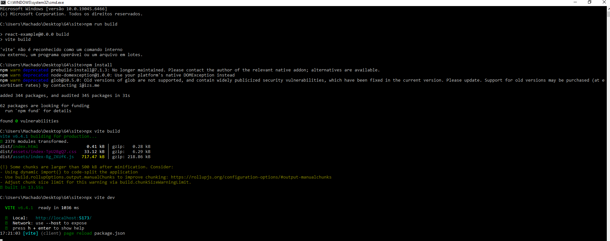
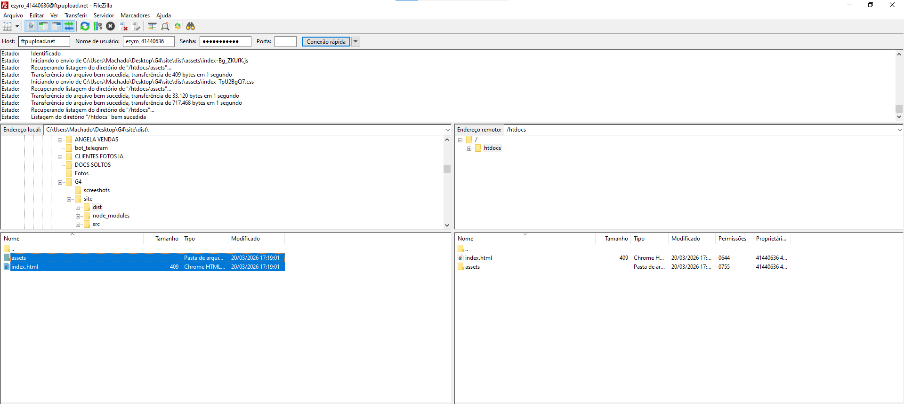
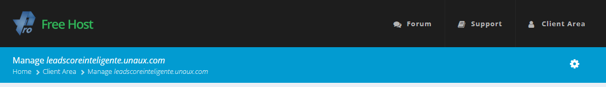
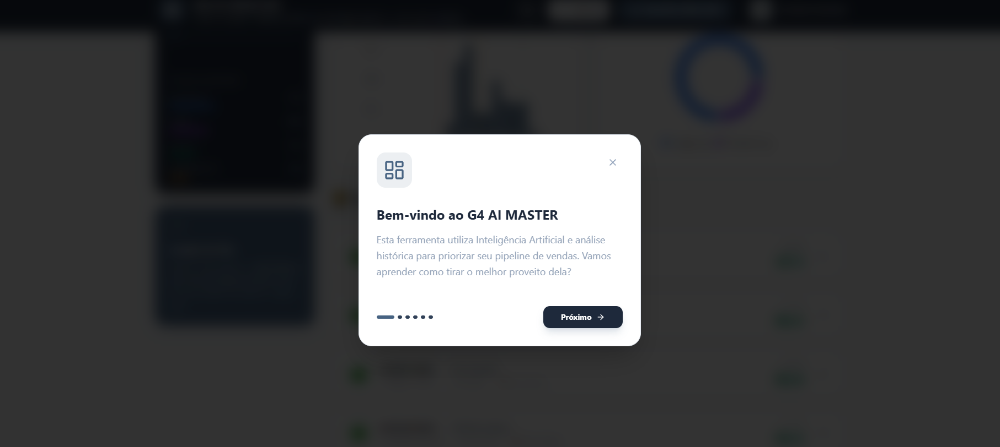
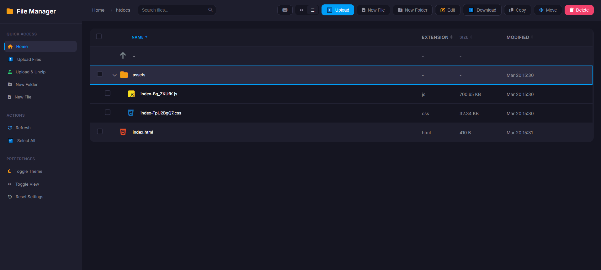

# 🛠️ Relatório de Processo Detalhado (Process Log) — Luiz Fernando Mendes

Este documento registra a jornada completa de desenvolvimento do **Lead Scorer Inteligente**, documentando a colaboração estratégica entre inteligência humana e artificial, erros superados e mudanças de rota.

---

## 1. Concepção e Mentoria Estratégica (O Fator Luiz)

O projeto iniciou com a criação de um **GEM personalizado no Gemini chamado "Luiz"**. Este nome é uma homenagem ao meu pai, falecido há menos de um ano. A base de conhecimento do Luiz foi estruturada com autores que focam em influência, criação de marcas e comportamento humano, como Napoleon Hill e Philip Kotler, unindo psicologia comportamental, marketing e vendas. Eu peguei toda a informação que o **G4** enviou e enviei para o Luiz me guiar.

- **Imagem 1**: Definição da base de conhecimento estratégica do mentor "Luiz".
> 

- **Imagem 1.1**: Minha metodologia de trabalho: utilizo um GEM específico para cada finalidade, garantindo que a IA atue com profundidade técnica em nichos isolados.
> 

- **Imagem 2**: Fase de brainstorming e consulta estratégica com o Luiz sobre a viabilidade e os pilares do sistema de scoring.
> 

---

## 2. Fase 1: Prototipagem em Python (Qwen + VS Code)

- **Imagem 3**: Com as diretrizes do Luiz, utilizei a IA chinesa **Qwen** para gerar o código bruto em Python.
> 

- **Imagem 4**: Submissão do resultado da Qwen para a auditoria do Luiz, garantindo que a lógica de negócios estava preservada.
> 

- **Imagem 5**: Configuração do ambiente no GitHub. Como utilizo a plataforma há menos de um mês, este passo documenta minha rápida curva de aprendizado em versionamento.
> 

- **Imagem 6**: Início da aplicação prática do código e iteração direta na Qwen.
> 

- **Imagem 7**: Monitoramento do processo de geração dos blocos de código.
> 

- **Imagem 8**: Revisão final do código gerado pela Qwen antes da implementação local.
> 

---

## 3. Desafios Técnicos e Intervenção Humana (Onde a IA Errou)

- **Imagem 9**: Teste inicial no **VS Code**. O código não funcionou de imediato, apresentando falhas de execução.
> 

- **Imagem 10**: Retorno ao mentor Luiz para diagnóstico do erro técnico apresentado.
> 

- **Imagem 11 (Correção Crítica)**: Durante o build, o ambiente Python 3.14 apresentou conflitos de dependência com o Streamlit. Identifiquei múltiplas instalações de Python e forcei a instalação via `python -m pip` para garantir a integridade do ambiente.
> 

- **Imagem 12 e 13**: Conclusão da instalação com persistência de erros, exigindo análise mais profunda dos logs.
> 
> 

- **Imagem 14 (Debug de Sintaxe)**: Identifiquei um erro de má formação de f-string na linha 590. Em vez de descartar o código, analisei a estrutura lógica, identifiquei a falta de fechamento da expressão e corrigi manualmente para garantir a exibição correta dos valores de preço.
> 

- **Imagem 15**: Resolução de erros secundários da IA ("erros bobos") que impediam a fluidez do sistema.
> 

- **Imagem 16**: Ajuste fino em trechos de código que apresentavam instabilidade devido à origem da IA geradora.
> 

- **Imagem 17 e 18**: Identificação e resolução de erros nas camadas inferiores do script para garantir o funcionamento do dashboard.
> 
> 

- **Imagem 19 (O Bug das Datas)**: O sistema não priorizava os leads corretamente porque a IA usava referências temporais de 2026 para um dataset de 2017. Ajustei a lógica para tratar os dados históricos com precisão.
> 

### D. Refinamento de Lógica de Negócio (Scoring Threshold)
- **O Erro**: O card "Requer Atenção" exibia valor zero. Identifiquei que a IA configurou o filtro para scores < 30, sendo que a pontuação mínima teórica do algoritmo era 32.5.
- **A Correção**: Ajustei manualmente o limite para < 50 e alterei a identidade visual do card para laranja, garantindo que o dashboard reflita fielmente os leads em zonas críticas (🟠 e 🔴).
> **Evidência:**  
---

## 4. Refinamento de UX e Identidade Visual (G4 Scale)

- **Imagem 20**: Decisão de mudar o layout para algo mais profissional e alinhado ao mercado.
> 

- **Imagem 21**: Pesquisa e coleta de referências visuais do **G4 SCALE** para inspiração estética.
> 

- **Imagem 22**: Aplicação da nova identidade visual (cores e componentes) no protótipo.
> 

- **Imagem 23**: Resolução de elementos "fantasmas" no código que não estavam sendo localizados pela IA.
> 

- **Imagem 24 e 25**: Ajuste de contraste e legibilidade. Percebi que o tom original dificultava a leitura e encontrei erros de design que a IA havia ignorado.
> 
> 

- **Imagem 26 e 27**: Implementação de funcionalidade de acessibilidade (Modo Claro e Escuro).
> 
> 

---

## 5. Arquitetura de Dados e Deploy

- **Imagem 28**: Decisão arquitetural sobre o consumo de dados: via planilhas locais ou integração por API externa.
> 

- **Imagem 29, 30, 31 e 32**: Processo de deploy no Netlify. Identifiquei e corrigi erros no arquivo `requirements.txt` que impediam a subida do app.
> 
> 
> 
> 

---

## 6. A Grande Virada: De Python para React

- **Imagem 33**: App funcionando, mas com performance lenta e fluxo pouco intuitivo para o usuário final.
> 

- **Imagem 34 e 35**: Tentativas de melhoria de design em Python sem sucesso. Tomei a decisão executiva de abandonar as 4 horas de trabalho em Python e migrar para **React via Google AI Studio** para garantir a entrega de um produto de alta qualidade.
> 
> 

- **Imagem 36**: Reconstrução total da lógica (100% funcional) no Google AI Studio e migração oficial para o novo repositório no GitHub.
> 

- **Imagem 37**: Organização dos dados na pasta `/data` e configuração da conexão da plataforma com as planilhas locais.
> 

## 7. Infraestrutura e Deploy de Alta Performance

Tive um problema com a hospedagem onde estava o sistem, por ser limitada, o sistema tem um limite de visualização, como eu não sei a quantidade de vezes que a G4 irá acessar, eu decidi trocar par aum outro. Iniciei o processo de deploy para um servidor de produção definitivo. Esta etapa exigiu a superação de barreiras técnicas de ambiente e a configuração de um pipeline de entrega manual via FTP pois o Google AI Studio não estava atualizando os aquivos no meu github, onde conecto con a hospedagem Netlify. Eu decidi baixar os arquivos e subir para a hospedagem nova via FTP.

- **Ação**: Identifiquei que o comando `vite` não estava sendo reconhecido globalmente no terminal.
- **Correção**: Executei o `npm install` para restaurar as dependências e utilizei o `npx vite build` para forçar a geração da pasta de produção (`dist`) de forma otimizada.
> **Evidência:**  

- **Ação**: Configuração de hospedagem em servidor externo via FTP.
- **Processo**: Utilizei o FileZilla (Porta 21) para realizar o upload manual do conteúdo da pasta `dist` diretamente para o diretório `public_html/htdocs`.
- **Ajuste Técnico**: Garanti que o `index.html` estivesse na raiz do servidor para que a Single Page Application (SPA) fosse carregada corretamente.
> **Evidência:** 

---

## 8. Resultado Final e Tutorial de Onboarding

- **Image 43**: A aplicação agora está hospedada em um domínio personalizado (leadscoreinteligente.unaux.com), oferecendo uma experiência estável e profissional para o usuário final.
> 

- **Image 44**: Implementação de um tutorial interativo de boas-vindas. Esta foi uma decisão de UX para garantir que qualquer vendedor entenda como conectar seus dados (CSV ou API) e interpretar o scoring sem necessidade de treinamento prévio.
> 
---

## 9. Resultado Final

- **Imagem 39 e 40**: Deploy final no Profreehost. Sistema 100% funcional, estável, com tutorial de boas-vindas e dashboard de alta performance.
> 
> 
